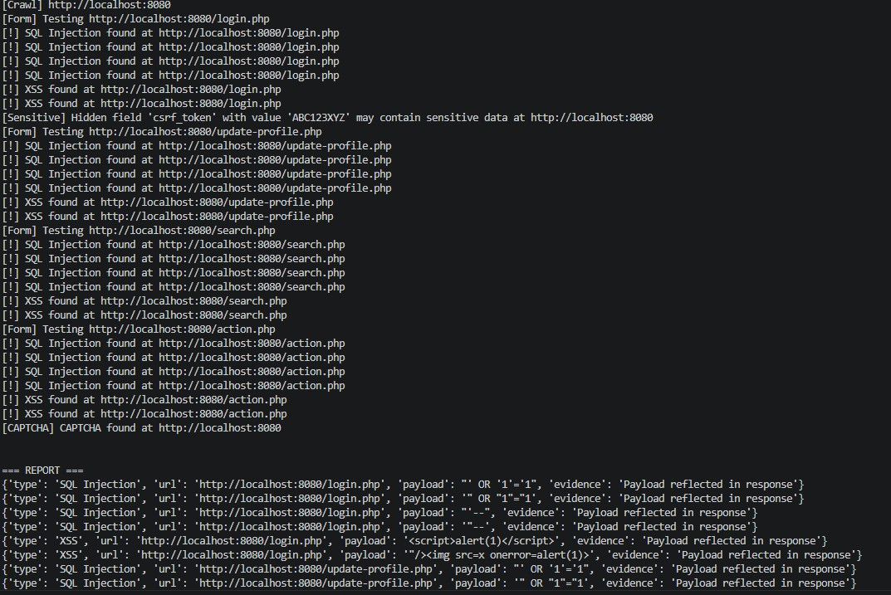

# daxemond-web-sec-scanner
This is a simple vulnerability scanner for web applications.

## PREVIEW

[](preview.jpg)

## User's Edge browser tabs metadata
The tab with `IsCurrent=true` is user's currently active/viewing tab, while tabs with `IsCurrent=false` are other open tabs in the background.

```json
edge_all_open_tabs = [
  {
    "pageTitle": "Cornerstone Health | Contact Us",
    "pageUrl": "https://www.cornerstonehealth.com.au/contact-us",
    "tabId": 882075767,
    "isCurrent": true
  },
  {
    "pageTitle": "daxemond/daxemond-web-sec-scanner: This is a vulnerability scanner for web application",
    "pageUrl": "https://github.com/daxemond/daxemond-web-sec-scanner",
    "tabId": 882075782,
    "isCurrent": false
  },
  {
    "pageTitle": "corner stone health - Search",
    "pageUrl": "https://www.bing.com/search",
    "tabId": 882075638,
    "isCurrent": false
  },
  {
    "pageTitle": "Cornerstone Health | Driven by Purpose",
    "pageUrl": "https://www.cornerstonehealth.com.au",
    "tabId": 882075653,
    "isCurrent": false
  },
  {
    "pageTitle": "asx code list - Search",
    "pageUrl": "https://www.bing.com/search",
    "tabId": 882075672,
    "isCurrent": false
  },
  {
    "pageTitle": "ASX Listed Companies (Full List) - Market Index",
    "pageUrl": "https://www.marketindex.com.au/asx-listed-companies",
    "tabId": 882075695,
    "isCurrent": false
  },
  {
    "pageTitle": "Web Security Scanner Test Page",
    "pageUrl": "http://localhost",
    "tabId": 882075737,
    "isCurrent": false
  },
  {
    "pageTitle": "corner stone health - Search",
    "pageUrl": "https://www.bing.com/search",
    "tabId": 882075739,
    "isCurrent": false
  }
]
